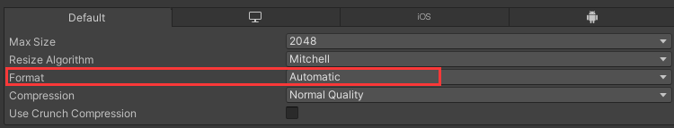
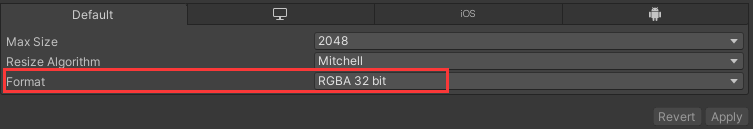

# 资源导出

## 1. 字图资源导出

- `SpriteExportTexture.cs` 脚本放置在 `Unity` 工程的 `Assets\Editor` 文件夹下。打开工程 `tools` 下面会多出 `导出精灵` 项

- 选择要导出的字图资源，`Read/Write Enabled` 勾选并点击 `Apply` 应用
  - 

- 编辑器 `tools` -> `导出精灵` 导出，导出资源路径在 `Assets\OutSprite` 下（可通过修改脚本改变导出路径等）

- 如果导出失败或者只导出一张不可查看的图。检查下字图 `Inspector` 的 `Default` 的 `Format` 选项。改成 `RGBA 32 bit`（或者可以修改脚本，在脚本里统一改）
  - 例如
  - 
  - 修改后
  - 