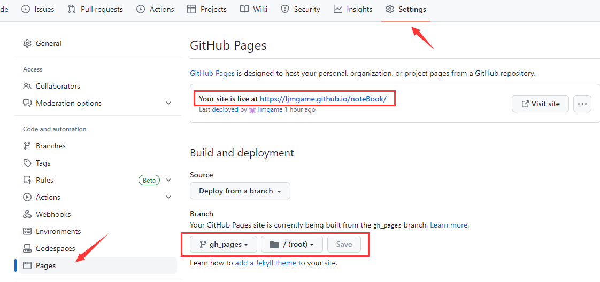

# 文档创建部署
  - [1. 环境](#1-环境)
    - [1.1. NodeJs](#11-nodejs)
    - [1.2. GitBook](#12-gitbook)
  - [2. 基本使用](#2-基本使用)
    - [2.1. 初始化项目](#21-初始化项目)
    - [2.2. 构建静态网页](#22-构建静态网页)
    - [2.3. 启动项目](#23-启动项目)
    - [2.4. 查看目录](#24-查看目录)
    - [2.5. 优缺点](#25-优缺点)
  - [3. 码云部署托管](#3-码云部署托管)
    - [3.1. 为什么用码云部署托管](#31-为什么用码云部署托管)
    - [3.2. 初始化本地仓库](#32-初始化本地仓库)
    - [3.3. 新建远程仓库](#33-新建远程仓库)
    - [3.4. 关联本地远程仓库](#34-关联本地远程仓库)
    - [3.5. 部署 Gitee Pages](#35-部署-gitee-pages)
    - [3.6. 更新文档](#36-更新文档)
  - [4. github 部署托管](#4-github-部署托管)
    - [4.1. 为什么用 github 部署托管](#41-为什么用-github-部署托管)
    - [4.2. 新建远程仓库](#42-新建远程仓库)
    - [4.3. 切换远程仓库](#43-切换远程仓库)
    - [4.4. 部署 GitHub Pages](#44-部署-github-pages)
    - [4.5. 更新文档](#45-更新文档)

## 1. 环境

### 1.1. NodeJs

- **nodejs 环境(略)**
~~~
# cmd
nvm list # 查看已下载的 node.js 版本列表
node -v # 查看 node.js 版本
npm -v # 查看 npm 版本
~~~

### 1.2. GitBook
- **gitbook 命令行工具安装**
~~~
# cmd
npm install -g gitbook-cli
~~~

- **查看 gitbook 版本**
~~~
# cmd
gitbook -V  # 注意 -V 为大写
# 结果
CLI version: 2.3.2
GitBook version: 3.2.3  # 若出现 Installing GitBook 3.2.3 ... 且长时间无提示与结果 是因为 npm 默认国外镜像速度较慢 可考虑换源重安装
~~~

- **npm 换源重安装**
~~~
# cmd
npm config set registry=http://registry.npm.taobao.org -g
gitbook -V
~~~

## 2. 基本使用

### 2.1. 初始化项目

 - **创建项目文件夹** -> **执行命令** -> **会在当前目录自动创建 `README.md` 和 `SUMMARY.md` 两个文件**
 - **`SUMMARY.md` 是章节目录**
~~~
# cmd || git
gitbook init
~~~

### 2.2. 构建静态网页

- **`gitbook build` 命令构建 `静态网页` 而不启动本地服务器，默认生成文件存放在 `_book/` 目录**
- **`静态网页` 主要用于 `发布准备阶段`，可打包上传服务器也可以上传 `GitHub` 等网站托管**

- 

### 2.3. 启动项目

- **`gitbook serve` 命令启动 `本地服务`，默认访问 `http://localhost:4000` 实时预览**
- **`本地服务` 主要用于 `开发调试阶段`，能够实时预览电子书效果，且大多数开发环境搭建在本地而不是远程服务器中**
- **本质是把 `_book/` 映射到网站的根目录**

- 

### 2.4. 查看目录

- **`tree` 命令**

- 

### 2.5. 优缺点

- **参考链接**
  - [知乎：gitbook体验](https://www.zhihu.com/question/26607715/answer/2237742517)

- **优点**
  - 支持本地图片插入（其他大部分貌似都不支持）
  - 支持各种插件，可丰富需求
  - 支持build成静态网页，方便部署、远端访问
  - 支持多人协作
- **缺点**
  - 对非程序员有门槛
- **目的**
  - 人的精力都是有限的，学过一次的东西就不需要从头再来。
  - 搭建起自己的知识管理平台、记录技术、总结、方法论、笔记等有价值的信息、积累自身
  - 随时随地通过网页来访问这些内容、极大地节省信息检索的时间
## 3. 码云部署托管

### 3.1. 为什么用码云部署托管

- **参考链接**
  - [Gitbook+码云创建自己的文档](http://www.taodudu.cc/news/show-1209689.html?action=onClick)

- **优点**
  - 相较部署服务器无成本
  - 更新方便
  - 国内访问快
- **缺点**
  - 需要实名认证才能使用 `Gitee Pages` 部署功能，表示这个很恶心

### 3.2. 初始化本地仓库

- **`git` 初始化本地仓库并提交变更**
~~~
# git
git init # 初始化仓库
# 提交变更
git add -A
git commit -m "初始化完成"
~~~

### 3.3. 新建远程仓库

- 码云新建仓库
  - 
  - 

- 创建完成
  - 

### 3.4. 关联本地远程仓库

- **`git` 本地仓库关联并推送远程仓库**
~~~
# git
git remote add origin https://gitee.com/ljmyx/note-book.git # 关联本地仓库与远程仓库
git push origin master  # 推送本地变更到远程仓库
~~~

### 3.5. 部署 Gitee Pages

- **需要 `绑定手机号` 和 `实名认证`**
- **需要先初始化远程仓库（就是把本地仓库首次推送到远程仓库）**
- **备注：因为要实名、先不用gitee，后续略过**

### 3.6. 更新文档

- **略**

## 4. github 部署托管

### 4.1. 为什么用 github 部署托管

- **参考链接**
  - [GitHub操作](https://blog.csdn.net/qq_44636569/article/details/125956203)

- **优点**
  - 不需要实名认证
- **缺点**
  - 国外地址访问慢

### 4.2. 新建远程仓库

- `github` 新建仓库
  - 
  - 

- 创建完成
  - 

### 4.3. 切换远程仓库

- **`git` 本地仓库切换远程仓库**
~~~
# git
git remote -v # 查看远程仓库地址
git remote set-url origin https://github.com/ljmgame/noteBook.git  # 切换新远程仓库
git remote -v # 查看是否成功
~~~

### 4.4. 部署 GitHub Pages

- **添加 `gh_pages` 分支部署**
- **为啥要多个 `gh_pages` 来部署待探究**
~~~
# git
# 远程仓库多了一个 gh_pages 分支并且分支里有 index.html文件，说明部署的代码上传成功
git subtree push --prefix=_book origin gh_pages 
git branch -a # 可以看到远程仓库多了个 gh_pages 分支
~~~

- **`Settings`** -> **`Pages`** -> **`Branch` 设置并点击 `Save` 保存** -> *文档地址：`*https://ljmgame.github.io/noteBook/`**
- `Save` 之后需等待几分钟后访问地址
  - 

### 4.5 更新文档

- **更新**
- **`master` 提交源码正常流程、可以考虑忽略 `_book`文件**
- **然后提交静态部署文件到 `gh_pages` 分支上**
```
# git
git subtree push --prefix=_book origin gh_pages # 更新静态部署
```