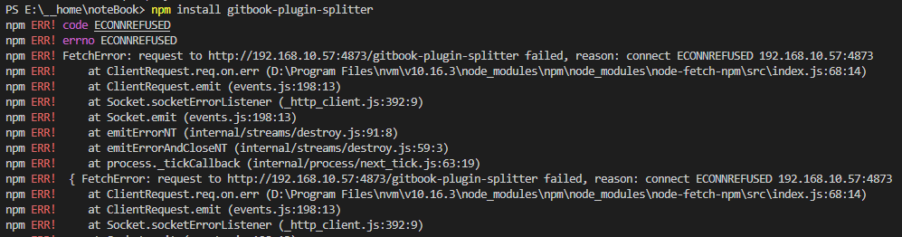
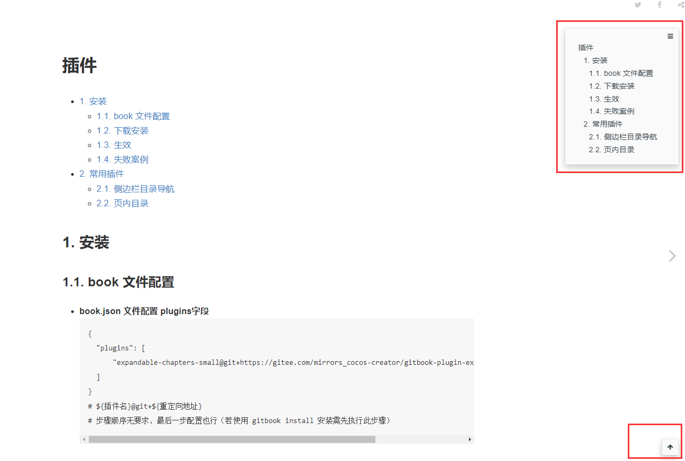

# 插件
  <!-- - [1. 安装](#1-安装)
    - [1.1. book 文件配置](#11-book-文件配置)
    - [1.2. 下载安装](#12-下载安装)
    - [1.3. 生效](#13-生效)
    - [1.4. 失败案例](#14-失败案例)
  - [2. 常用插件](#2-常用插件)
    - [2.1. 侧边栏目录导航](#21-侧边栏目录导航)
    - [2.2. 页内目录](#22-页内目录) -->

## 1. 安装

### 1.1. book 文件配置

- **book.json 文件配置 plugins字段**
~~~
{
    "plugins": [
        "expandable-chapters-small@git+https://gitee.com/mirrors_cocos-creator/gitbook-plugin-expandable-chapters-small.git"
    ]
}
// ${插件名}@git+${重定向地址}
// 步骤顺序无要求、最后一步配置也行（若使用 gitbook install 安装需先执行此步骤）
~~~

### 1.2. 下载安装

- **方式一：npm install**
~~~
// cmd
npm init -y // 若无 package.json 执行此命令、其中 -y 表示直接生成默认文件
npm install gitbook-plugin-${插件名}    // 下载安装插件
npm install gitbook-plugin-${插件名}@git+${重定向地址}  // 下载安装插件、若默认下载不行则重定向下载地址
~~~

- 

- **方式二：gitbook install**
~~~
// cmd
gitbook install // 可能不太好用
~~~

- **方式三：直接下载源码，放到 node_modules 文件夹里**

### 1.3. 生效

- **重启服务或者重新打包构建可看到效果**
~~~
// cmd
gitbook serve // 重启服务
~~~

### 1.4. 失败案例
- **案例一**
- 
~~~
// 使用 vpn 或者 代理服务器时，可能会导致网络请求失败
// 此报错之前有设置过 淘宝源 npm config set registry https://registry.npm.taobao.org 所以这里去掉试试
// 地址：C:\Users\admin下 .npmrc 文件打开 去掉 registry=http://192.168.10.57:4873/ 这行保存
// 重新执行 npm install gitbook-plugin-splitter 成功
~~~

## 2. 常用插件

### 2.1. 侧边栏目录导航
- **gitbook 默认左侧为目录索引导航、且默认目录是全部展开的**

#### 2.1.1. chapter-fold
- **略**

#### 2.1.2. expandable-chapters
- **略**

#### 2.1.3. expandable-chapters-small
- **可使目录默认折叠且展开后不会自动折叠，箭头相比 expandable-chapters 会细一些**
~~~
{
    "plugins": [
        "expandable-chapters-small@git+https://gitee.com/mirrors_cocos-creator/gitbook-plugin-expandable-chapters-small.git"
    ]
}
// 地址重定向：默认地址下载不到、这里重定向到国内地址
// bug：该重定向地址的插件有问题、只能同时展开一个子目录。
// bug优化：laya文档也使用该插件且没有bug、对比了下代码有优化。后面该插件迁移自己的地址参照优化后再重定向新地址重新拉取
~~~

#### 2.1.4. splitter
- **侧边栏宽度调节**
~~~
{
    "plugins": [
        "splitter"
    ]
}
~~~

### 2.2. 页内目录

#### 2.2.1. page-treeview-simple
- 支持 **生成页内目录**
- 能支持到6级目录
- 在 page-treeview 功能基础上修改以下两点
~~~
1、去除 版权文字内容与占用的空白高
2、取消章节的折叠效果，默认展开显示完整章节 //这点好像都是默认展开
~~~
~~~
{
    "plugins": [
        "page-treeview-simple"
    ],
    "pluginsConfig": {
        "page-treeview-simple": {
            "minHeaderDeep": "2"    // 试了下没效果、真鸡肋
        }
    }
}
// 此插件通过获取 # 字符实现。所以 行 里首个符号为 # 的内容会被生成到目录里。即使被标记到代码框里
// 和 page-treeview 一样强制支持到6级目录、不能手动配置支持级数。体验真差
~~~

#### 2.2.2. anchor-navigation-ex
- 支持 **悬浮目录** 和 **回到顶部**
- **悬浮目录：页面右上角生成条纹按钮、鼠标移入展开悬浮目录**
- **回到顶部：页面右下角生成箭头按钮、点击回到页面顶部**
- 此插件只会提取 h[1-3] 标签作为 悬浮导航
- [更多配置介绍](https://github.com/zq99299/gitbook-plugin-anchor-navigation-ex/blob/master/doc/config.md)
~~~
{
    "plugins": [
        "anchor-navigation-ex"
    ],
    "pluginsConfig": {
        "anchor-navigation-ex": {
            "showLevel": false  // 标题是否显示层级序号、true则页面标题和悬浮导航中标题都会加上层级序号。若编辑中自行添加则设置false
            "showGoTop": false  // 是否显示返回顶部按钮
        }
    }
}
~~~
- 