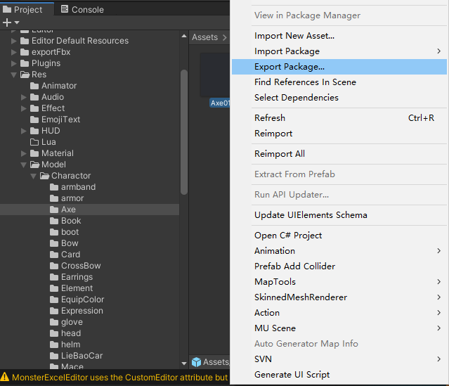
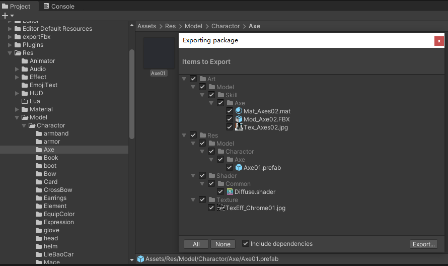
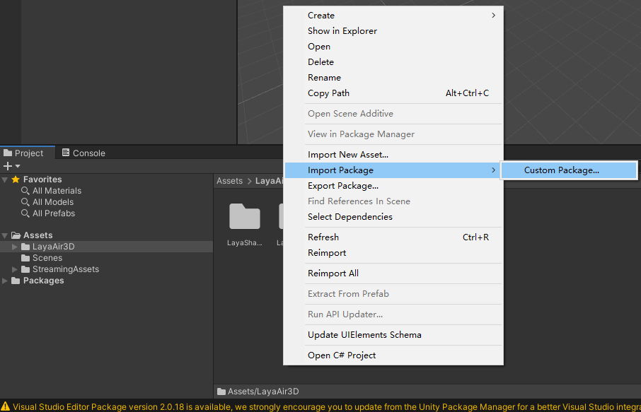
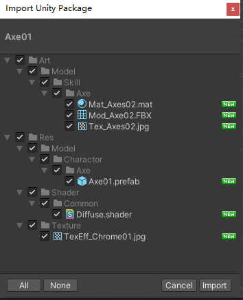
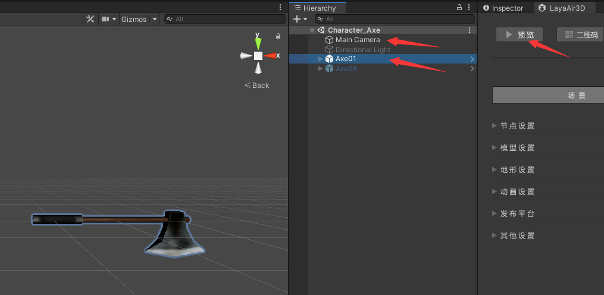
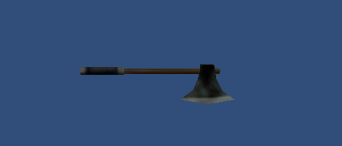
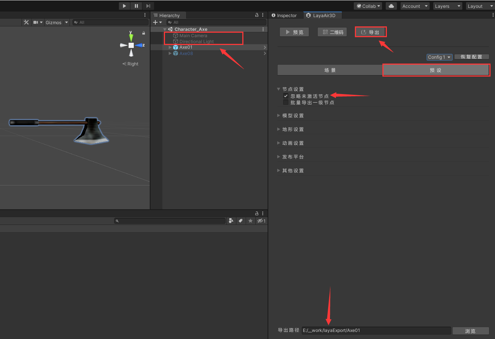
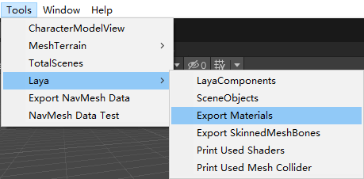

# laya-unity插件导出

## 1. 插件安装

- [插件安装教程](https://ldc2.layabox.com/doc/?nav=zh-ts-4-2-0)

## 2. unity工程导出

- `Project` 窗口 -> 选择要导出的预制体 -> 右键 `Export Package` ->  选择预制体及其依赖资源点击 `Export`
- 导出的依赖资源可以不勾选 `cs` 文件
  - 
  - 

## 3. mu unity 工程导入

- 空白右键 `Import Package` -> `Custom Package` -> 选择导入的 `unitypackage` 文件 -> `Import Unity Package` 窗口选择导入文件点击 `Import`

- `Import Unity Package` 窗口只选择 绿色 new 标记的（这里应该指 `mat 材质文件` 和 `shader` 文件）

  - 
  - 

### 3.1 新增材质处理

## 4. 场景预览展示

### 4.1 道具模型

- 打开 `Assets/Art/Scene/xx.unity` 场景（哪个场景这里约定与预制体资源路径有关系）
  - 例如：`Assets/Res/Model/Charactor/Axe/Axe01.prefab` 对应 `Assets/Art/Scene/Character_Axe.unity` 场景

- 将预制体拖到场景中（场景中 active == false 的不会导出）

- `unity 工程` 使用 `URP 渲染管线`，`mu-unity 工程` 使用 `内置渲染管线`（可能这个引擎版本还不支持 `URP`）。`shader` 文件需要从 `HLSL` 转成 `CG`。否则预览不显示材质
  - 注：想尝试别的unity版本升级下URP、看看升级URP支持的引擎版本，但是没有破解失败了先作罢

- 确认场景上 `照相机` 和 `预制体` 为激活状态，点击 `LayaAir3D` 插件界面上的 `预览`。然后会自动弹出浏览器显示预览效果。
  - 这里临时修改了预制体 `Y坐标90度`，并调整了 `Scene Gizmo` 角度。方便与预览角度一致
  - 
  - 若预览为黑屏，可能是场景相机未激活
  - 

### 4.2 特效模型

## 5. 导出资源

### 5.1 导出预设资源
- 设置 `照相机` 和 `灯光` 为未激活状态 -> 选择 `预设` -> 勾上 `忽略未激活节点` -> 填写 `导出路径` -> 点击 `导出`
  - 这里把预览时的预制体 `Y坐标90度` 还原 
  - 

### 5.2 导出 unity 材质数据
- `导出预设资源` 时会导出默认laya的材质。这里自定义插件（若增加新材质需编辑此插件新增、此插件可能参考了laya插件的导出材质部分）将 unity 材质的数据导出。
  - 

#### 5.2.1 情况1：`导出 unity 材质数据` 直接覆盖 `导出预设资源`
- 这里会直接覆盖修改 mat 文件

#### 5.2.2 情况2：`导出 unity 材质数据` 另起文件夹
- 未遇到

## 6. 资源放置工程