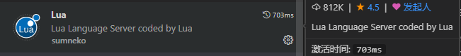
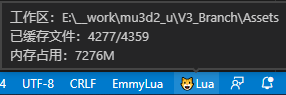
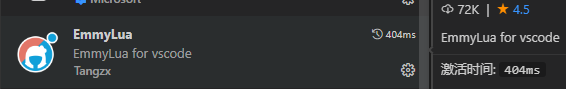
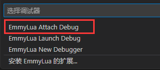
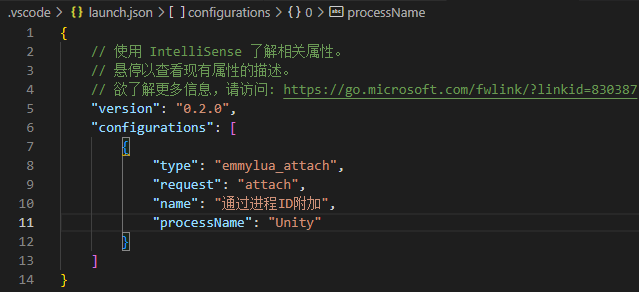
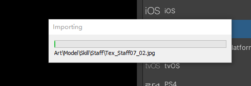

# lua编程
  - [1. 编辑环境](#1-编辑环境)
    - [1.1. 环境安装](#11-环境安装)
    - [1.2. 注意](#12-注意)
    - [1.3. 功能](#13-功能)
  - [2. 调试](#2-调试)
    - [2.1. vscode配置](#21-vscode配置)
    - [2.2. unity配置](#22-unity配置)
    - [2.3. 运行调试](#23-运行调试)
    - [2.4. EmmyLua 支持编程环境](#24-emmylua-支持编程环境)

## 1. 编辑环境

### 1.1 环境安装

- vscode
- lua插件：[sumneko.lua](https://marketplace.visualstudio.com/items?itemName=sumneko.lua)
    - vscode 插件安装 搜索 `lua` 作者为 `sumneko`
    - 
- 参考链接
  - [VSCode Lua 编辑环境与常用操作](https://zhuanlan.zhihu.com/p/399194751)

### 1.2 注意

- 缓存文件占用内存大 vscode 从 assets 文件夹打开就好。容易崩溃
  - 

### 1.3 功能

### 1.3.1 跳转定义
- `Ctrl + 鼠标左键` 点函数名

### 1.3.2 跳转定义 - 前后跳
- `Alt + LeftArrow` 向前跳
- `Alt + RightArrow` 向后跳

### 1.3.3 查找引用
- `鼠标右键` -> `转到引用`

### 1.3.4 查看注释
- 悬停符号上显示注释信息

### 1.3.5 重命名符号
- 一般用于把某个作用域内的符号 `批量` 改名
- `右键符号` -> `重命名`

### 1.3.6 自动补全与提示
 - 根据已有函数、变量定义，自动生成可选列表，方便快速输入、避免打错变量名

## 2. 调试

### 2.1 vscode配置

- 安装插件：`EmmyLua`
    - 

- 添加配置：`运行` -> `添加配置` -> 选择 `EmmyLua Attach Debug`
    - 

- 根目录 `.vscode` 下会自动生成 `launch.json` 文件
    - 

- `奇迹H5` 项目修改 `launch.json` 文件
    - 

### 2.2 unity配置

- 设置平台为 `Android`：`File` -> `Build Settings` -> `Platform` 选择 `Android` -> 点击 `Build` (会编译挺长时间，耐心等待)
    - 
    - 

### 2.3 运行调试

- `vscode F5` 跳出 `Select the process to attach`
    - 

- `vscode F5` 如果没跳出框而是提示 `No process for attach` 可能插件的文件被360杀毒删除了，需要去 `360杀毒` 还原
    - 
    - 

- `Select the process to attach` 选择要调试的 `Unity` 进程，并通过 `360` 报警。此时 `vscode` 调试状态中
    - 

- 运行 `Unity` 工程、vscode 工程断点开始调试

### 2.4 EmmyLua 支持编程环境

- `EmmyLua` 支持lua编程各个功能，例如 `跳转定义`、 `查找引用` 等。需要 `java` 环境。但是 `vscode` 里 `load workspace` 一直卡一半这里放弃改用 `sumneko.lua`

