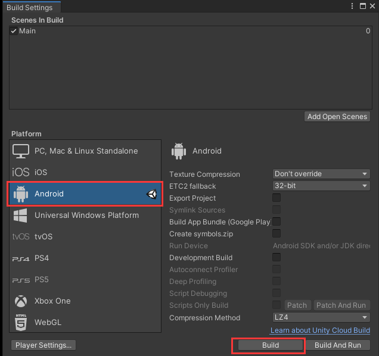

# mu 手游工程包
  - [1. 运行奇迹 mu 手游工程包](#1-运行奇迹-mu-手游工程包)
      - [1.1. 其他细节](#11-其他细节)

## 1. 运行奇迹 mu 手游工程包

- 切换 `Android` 平台
    - 

- 修改 `Assets/Src/Lua/GameModel/LoginData.lua` 文件

- 删除 `Assets/ThirdParty/XLua/Gen` 文件夹（不删也可以跑、不知道影响的地方是哪里）

- 切换主场景运行 `Assets/Main.unity`

## 1.1 其他细节

- 关闭报错暂停：`Console` -> `Error Pause`、如果被选择，无影响游戏的报错会使游戏暂停。容易误会游戏卡死。

- 游戏运行时的一些报错修改。比如：颜色 `字符串` 转 `Number` 类型